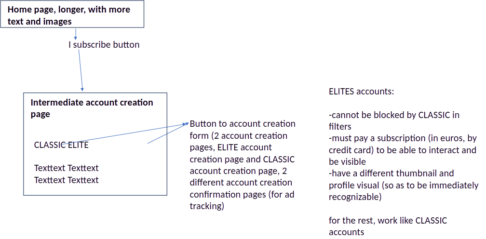

# 1. Mobile App design v2 ppt

**SLIDE 1: Functioning**

2 types of profiles, ELITES (paid, cannot be blocked in filters) CLASSIC (free) choice page accessible with the “I register” button before the “account creation form”

Payment is made by credit card, number, price and duration to be chosen in the admin interface 

Geolocation by country (each country is “blocked”) users can only see users from their country

All profiles from a country can see all profiles from that country (unless blocked in one of the filters)

The ELITE profiles have a different visual (thumbnail and profile detail) than those of the CLASSIC,

Filter to manage the display of profiles (see the “I want to see” profiles)

Filter to manage the display of your profile in the list of other users' profiles (not to be seen "I want to block")

ARCHIVE page, allows you to remove profiles from the profile list, to put them in the archive list (page as a black list) possibility of unarchiving a profile (putting it back in the profile list and removing it from the archive list)

FAVORITES page, allows you to remove profiles from the profile list, to put them in the favorites list, possibility to remove the profile from the favorites list to put it back in the profile list

MATCH page, allows you to quickly “classify” profiles, possibility of liking or sending a message, scrolling through profiles in order of connection, profiles classified according to user action, either archived, favorited or left in the profile list,

if left in the profile list, the profile will not reappear on the match page until 24 hours have passed (time to be chosen in the administrator interface)

CAPTCHA + “Stronger” control when creating an account (avoid re-creation of accounts by banned users) cost of phone number verification? (initially, email verification)

age of the profile displayed on the profile thumbnail (number of days since account creation)

Number of times since last connection displayed on the profile thumbnail (minute, hour, days, the color is green if connected, orange if connected less than 24 hours ago and red if connected more than 24 hours ago, duration to be chosen in the admin interface )

Messaging, add a filter by checkbox (possible to check both) ELITE/CLASSIC, to display messages from ELITE or CLASSIC profiles or both (the profile icon (photo/avatar) must have a different visual for ELITE and CLASSIC)

-Reporting, choice of reason by checkbox + free text, gives access to the entire discussion on the admin interface , only records one report per profile per person,

If 5 reports (choice of the number in administrator) a warning notification is automatically sent to the profile concerned,

If 2 warnings (choice of the number in administrator) when counting the 2nd warning the profile concerned is automatically banned, a notification appears at each connection attempt "your account has been banned please contact by email at XXXXXX”

In administrator, access to automatically banned accounts, with search filter (date, nickname etc. ) and list of reports and access to the discussions concerned

Possibility to restore the account, if restored, the account leaves with 0 warnings and reports,

-Account certification, to be defined

-multi-account blocking, to be defined

-be able to send and listen to voice messages in the messaging system

-profile photos, each photo (new or replacement) published by a user is visible but arrives in an administrator section, possibility to leave or ban the photo, if photo ban, choice "count a warning" or "ban without warning" counts or not a warning for automatic ban (quantity and nature to be chosen in admin)

**Operation V2**

-users can put a video in their profile details in addition to photos, limited to 5 seconds (duration to be chosen in admin ) profile videos are visible in the profile details and in the thumbnails of the profile list, favorites, archive and match, the videos are first subject to administrator validation (when the user puts a profile video, it arrives in an administrator menu, with the possibility of validating or refusing the video, if refused, possibility of writing a comment of 200 characters sent by notification to the user, possibility of putting a warning,

The profile video is visible to other users only after administrator validation,

-possibility to insert video ad, with clickable link, frequency managed by administrator (every X messages and or x different people contacted (message) and or like and or viewed in real time )

- real The user can upload a video ( real ) from his profile details, limited to 15 seconds (duration to be chosen in administrator) visible 24 hours (duration to be chosen in administrator) and limited to 1 video (quantity to be chosen in administrator) per user (can publish a new one by deleting the previous one or when the previous one will be automatically deleted after 24 hours). The videos appear in the REEL section,

In the filters, add the possibility by check boxes to choose “archived profiles” “favorite profiles” “list profiles” by default all checked

possibility to report and ban a video, automatic ban every 2 (choice of the number in administrator) reports

Arrives in an administrator section, viewing and choice of permanent ban or restoration,

A real permanently banned = a warning (number and nature (warning or report) to be chosen in admin ) in the count for profile ban, sending a notification to the user,

The visual is different for ELITES profiles and CLASSIC profiles

-STORY The user can upload a photo and write a text (story) from his profile details or from the STORY page, limited to 1 photo and 500 characters (quantity to be chosen in administrator) visible 24 hours (duration to be chosen in administrator). 

and limited to 1 publication (quantity to be chosen in administrator) per user (can publish a new one by deleting the previous one or when the previous one will be automatically deleted after 24 hours)

Publications appear in the STORY section,

In the filters, add the possibility by check boxes to choose “archived profiles” “favorite profiles” “list profiles” by default all checked

possibility to report and ban a story, automatic ban every 2 (choice of the number in administrator) reports

Arrives in an administrator section, viewing and choice of permanent ban or restoration,

A permanently banned story = a warning (number and nature (warning or report) to be chosen in admin ) in the count for profile ban, sending a notification to the user,

The visual is different for ELITES profiles and CLASSIC profiles

-REACTION a subject is chosen by the administrator, text and or photo, is valid for 24 hours (duration to be chosen in admin , from midnight to midnight user time) a tool in administrator allows to program the publication of subjects over a period of 30 days,

The user can publish a reaction from his profile details, limited to 1000 characters (number to be chosen in administrator) visible until the end of the subject (at midnight user time). and limited to 1 publication (quantity to be chosen in administrator) per user (can publish a new one by deleting the previous one or when the previous one will be automatically deleted when the subject is finished (midnight user time)

Reactions appear in the profile details and in the reaction section,

In the filters, add the possibility by check boxes to choose “archived profiles” “favorite profiles” “list profiles” by default all checked

last 30 reactions visible in profile details (quantity to be chosen in admin )

possibility to report and ban a reaction, automatic ban every 2 (choice of the number in administrator) reports

Arrives in an administrator section, viewing and choice of permanent ban or restoration,

A permanently banned reaction = a warning (number and nature (warning or report) to be chosen in admin ) in the count for profile ban, sending a notification to the user,

The visual is different for ELITES profiles and CLASSIC profiles

-EVENT The user can create and publish 5 events (quantity to be chosen in administrator) the user chooses the start date and end date of the event, the category (drop-down list to be created in administrator) of the event and the location of the event, chooses a title and a description limited to 500 characters and 1 image (quantity to be chosen in administrator )

Events appear in the profile details and in the event section,

In the filters, add the possibility by check boxes to choose “archived profiles” “favorite profiles” “list profiles” by default all checked

Participate, opens a participation form, upon validation the form is sent to the user who published the event, he can accept or refuse, a notification is sent to the participant

possibility to report and ban an event , automatic ban every 2 (choice of the number in administrator) reports

Arrives in an administrator section, viewing and choice of permanent ban or restoration,

A permanently banned event = a warning (number and nature (warning or report) to be chosen in admin ) in the count for profile ban, sending a notification to the user,

The visual is different for ELITES profiles and CLASSIC profiles

- a menu in the REEL, STORY, REACTION, EVENT pages allows the user to create a publication, to consult the likes and comments received from his publications

The number of “unseen” interactions is displayed in the menu (example like 5 comments 10) the total number is displayed in the like list or comment list page,

SLIDE 4: 

SLIDE 5: Account Creation Page

- pseudo
- sex
- age
- country (automatically filled in by geolocation)
- city (drop-down list / automatically filled by geolocation)
- Interested in: friend, love, passion (check box, possible to check more than one)
- passion (drop-down list, the list items are created from the administrator account) (note that you can check a maximum of 2)
- e-mail
- login ID
- password
- confirm password
- Accept T&Cs

All fields are required

country geolocation, each user can only see profiles from their country

Identification method? (email, phone, facial recognition, etc.)

